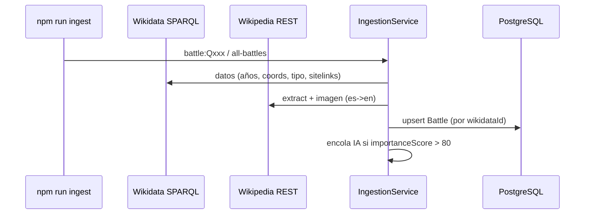
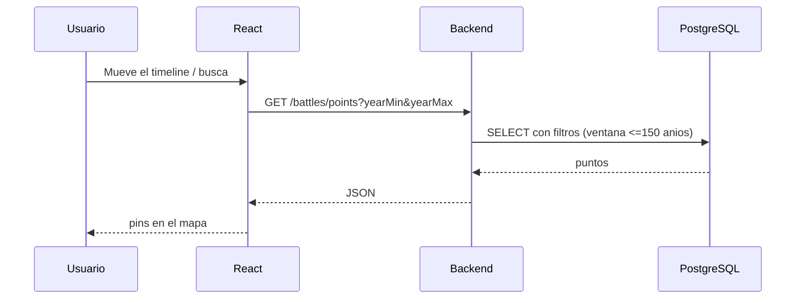

# Flujo de datos

Cómo viajan los datos desde Wikidata/Wikipedia hasta la pantalla.

---

## 1. Ingesta (Wikidata/Wikipedia → BD)

---

## 2. Consulta (Frontend → API → BD)

---

## 3. Narrativa por IA (background)

El usuario Premium pide `GET /battles/:id/ai-story`: si existe, 200; si no, 202
y se **encola**. El worker genera con el LLM y guarda en `BattleAISummary`
(cache permanente). Detalle en [IA (LLM)](../backend/ia.md).
