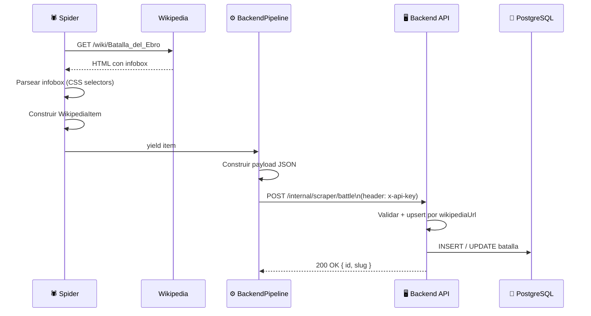
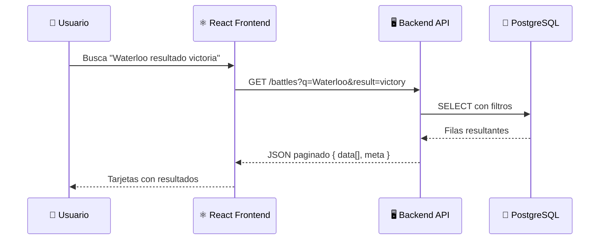

# Flujo de datos

Cómo viajan los datos desde Wikipedia hasta la pantalla del usuario.

---

## 1. Extracción (Scraper → Backend)



### Deduplicación

El endpoint `/internal/scraper/battle` hace un **upsert por `wikipediaUrl`**. Si la batalla ya existe en la BD, actualiza sus campos en lugar de crear un duplicado. Esto permite re-ejecutar el scraper sin problemas.

---

## 2. Consulta (Frontend → API → BD)



---

## 3. Normalización del scraper

Los datos de Wikipedia llegan en texto libre. El spider hace una primera normalización, y el resto queda pendiente para futuras iteraciones del pipeline:

| Campo | Raw (Wikipedia) | Estado actual | Normalización futura |
|---|---|---|---|
| Fecha | `"18 de junio de 1815"` | Se envía como `dateText` | Parsear a ISO 8601 → campo `date` |
| Coordenadas | `"43°N 2°E"` | Se envía como texto raw | Convertir DMS a `{ lat, lon }` WGS84 |
| Bajas | `"40.000–45.000"` | Se envía como texto raw | Extraer `{ min, max }` enteros |
| Image URL | `//upload.wikimedia.org/…` | Se normaliza a `https://` ✅ | — |

---

## 4. Seguridad del endpoint interno

El endpoint `/internal/scraper/*` está protegido por un guard de API key:

```
POST /internal/scraper/battle
Header: x-api-key: <SCRAPER_API_KEY>
```

Si la cabecera no está presente o no coincide con la variable de entorno `SCRAPER_API_KEY` del backend, la petición se rechaza con HTTP 401.
