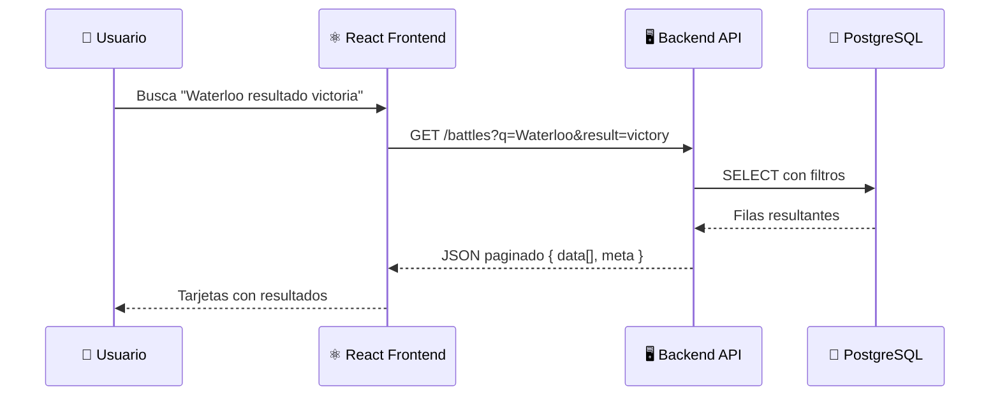

# Flujo de datos

Cómo viajan los datos desde Wikipedia hasta la pantalla del usuario.

---

## 1. Consulta (Frontend → API → BD)

```mermaid
sequenceDiagram
    participant US as 👤 Usuario
    participant FE as ⚛️ React Frontend
    participant BE as 🖥️ Backend API
    participant DB as 🐘 PostgreSQL

    US->>FE: Busca "Waterloo resultado victoria"
    FE->>BE: GET /battles?q=Waterloo&result=victory
    BE->>DB: SELECT con filtros
    DB-->>BE: Filas resultantes
    BE-->>FE: JSON paginado { data[], meta }
    FE-->>US: Tarjetas con resultados
```

---

