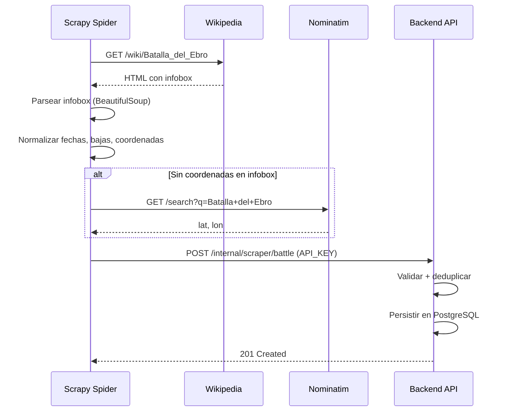
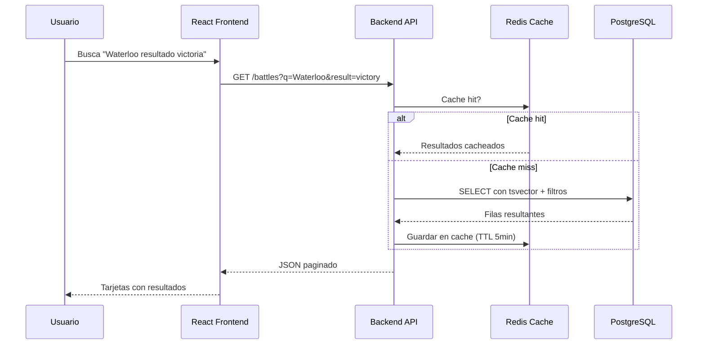

# Flujo de datos

Cómo viajan los datos desde Wikipedia hasta la pantalla del usuario.

---

## 1. Extracción (Scraper → API)

---

## 2. Consulta (Frontend → API → BD)

---

## 3. Normalización del scraper

El spider aplica estas transformaciones antes de enviar datos a la API:

| Campo | Raw (Wikipedia) | Normalizado |
|---|---|---|
| Fecha | `"18 de junio de 1815"` | `1815-06-18` (ISO 8601) |
| Bajas | `"40.000–45.000"` | `{ min: 40000, max: 45000 }` |
| Coordenadas | `"43°N 2°E"` | `{ lat: 43.0, lon: 2.0 }` (WGS84) |

---

## 4. Deduplicación

El backend evita duplicados en dos niveles:

1. **Redis set**: el scraper registra cada URL procesada. Las URLs ya vistas se saltan sin petición.
2. **Upsert en BD**: el endpoint `/internal/scraper/battle` hace `upsert` por `wikipediaUrl`. Si la batalla ya existe, actualiza los campos en lugar de crear un duplicado.
