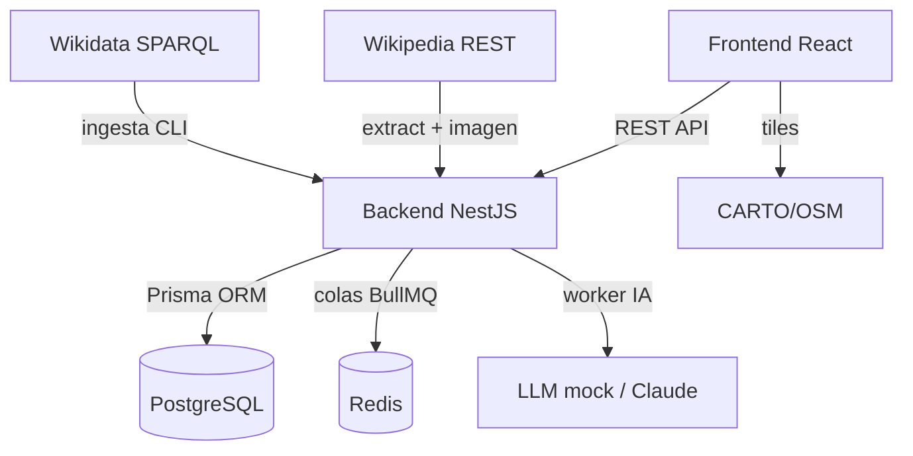

# Arquitectura — Visión general

Bellum Atlas son **dos servicios** (backend y frontend) más la infraestructura
(PostgreSQL + Redis). Los datos se cargan por **ingesta** desde Wikidata y
Wikipedia mediante un comando CLI del backend; no hay scraper aparte.

---

## Diagrama de servicios

---

## Principios de diseño

### Zero Real-Time Generation (IA)
El LLM **nunca** se llama dentro de una request del usuario. La narrativa se
precomputa en background con workers (BullMQ) y se cachea de forma permanente.
Ver [IA (LLM)](../backend/ia.md).

### Modelo simple
Una sola entidad de dominio (`Battle`) + el caché de IA. Sin guerras ni
comandantes. Ver [Modelo de datos](modelo-datos.md).

### Carga acotada
Las consultas por años se limitan a ventanas de **150 años** para no devolver
miles de batallas de golpe.

---

## Secciones de arquitectura

- [Stack tecnológico](stack.md)
- [Modelo de datos](modelo-datos.md)
- [Flujo de datos](flujo-datos.md)
