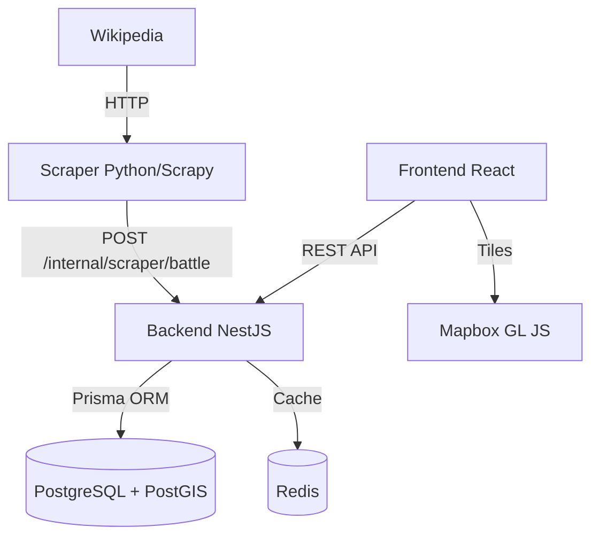

# Arquitectura — Visión general

AresCodex sigue una arquitectura de **tres servicios desacoplados** que se comunican mediante HTTP. Ningún servicio escribe directamente en la base de datos de otro: toda inserción de datos pasa por la API del backend.

---

## Diagrama de servicios

---

## Principios de diseño

### Separación de responsabilidades
El scraper extrae, el backend valida y persiste, el frontend presenta. Ningún servicio mezcla responsabilidades. Esto permite escalar o reemplazar cualquier capa sin tocar las demás.

### Arquitectura preparada para el futuro
El modelo de datos está diseñado para que features post-MVP (IA, colecciones, workspace, exportación) se añadan como modelos nuevos o campos opcionales, sin migraciones destructivas.

### Sin escritura directa a la base de datos
El scraper nunca conecta directamente con PostgreSQL. Toda inserción pasa por `POST /internal/scraper/battle`, donde el backend aplica validación, deduplicación y normalización centralizadas.

---

## Secciones de arquitectura

- [Stack tecnológico](stack.md) — Tecnologías elegidas y justificación
- [Modelo de datos](modelo-datos.md) — Entidades Prisma y sus relaciones
- [Flujo de datos](flujo-datos.md) — De Wikipedia a la pantalla del usuario
