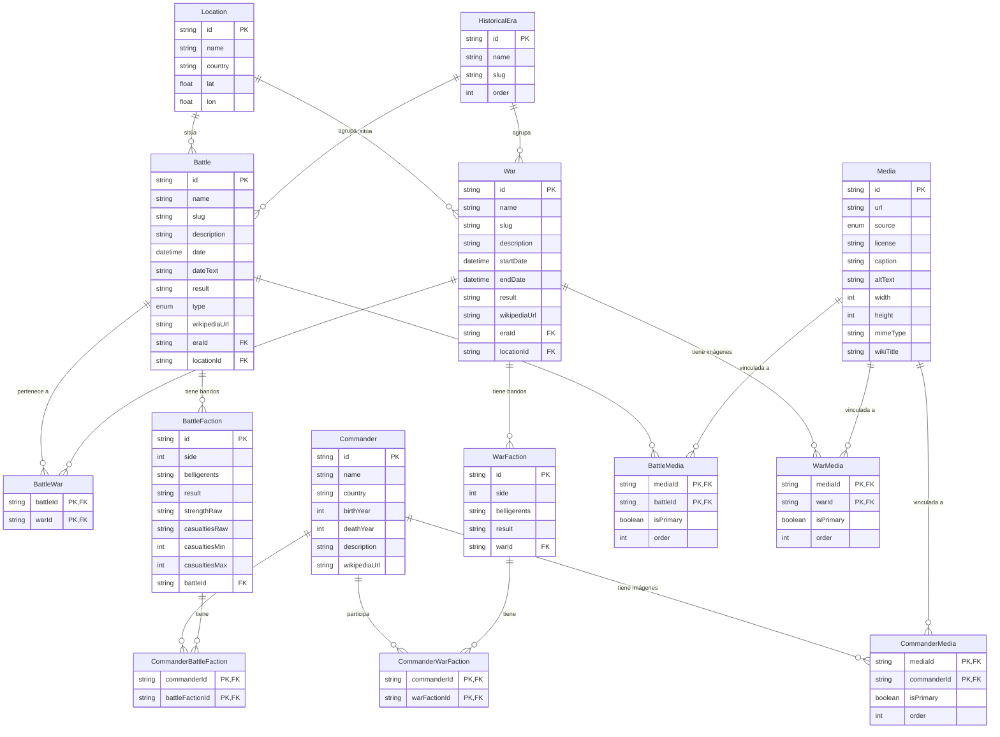

# Modelo de datos

El esquema Prisma está diseñado para reflejar fielmente la estructura de las infoboxes de Wikipedia: dos bandos por enfrentamiento, con beligerantes, comandantes y bajas por lado.

**Principio de extensibilidad**: las features post-MVP (IA, colecciones, workspace, exportación) se añaden como modelos nuevos que referencian los existentes por foreign key, sin migraciones destructivas.

---

## Diagrama entidad-relación



---

## Relaciones clave

### Battle ↔ War (muchos a muchos)

Una batalla puede pertenecer a 0 o más guerras (ej: la Batalla del Atlántico forma parte de la Segunda Guerra Mundial y de la Batalla del Atlántico como conflicto). Una guerra contiene 0 o más batallas.

La tabla de unión `BattleWar` no tiene campos extra: solo el par `(battleId, warId)`.

### Commander ↔ Battle y Commander ↔ War

Los comandantes se vinculan a batallas y guerras **a través de las facciones**, no directamente. Esto preserva la información de qué bando comandaron.

```
Commander → CommanderBattleFaction → BattleFaction → Battle
Commander → CommanderWarFaction    → WarFaction    → War
```

Gracias a esta cadena, se puede consultar:
- Todas las batallas de un comandante (con su bando y resultado)
- Todos los comandantes de una batalla, agrupados por bando
- El ratio de victorias de un comandante

### BattleFaction y WarFaction

Cada `BattleFaction` representa **un bando** de un enfrentamiento (máx. 2 por batalla, identificados por `side = 1` o `side = 2`). Captura exactamente lo que Wikipedia muestra en las infoboxes:

| Campo | Ejemplo |
|---|---|
| `belligerents` | `"Francia \| Guardia Imperial"` |
| `result` | `"victory"` |
| `strengthRaw` | `"72.000 hombres"` |
| `casualtiesRaw` | `"40.000–45.000"` |
| `casualtiesMin` / `casualtiesMax` | `40000` / `45000` |

### Media ↔ Battle / War / Commander (muchos a muchos)

Un ítem de media puede estar vinculado a múltiples entidades (una misma imagen puede aparecer en la ficha de una batalla y en la de la guerra padre). Cada entidad puede tener múltiples imágenes.

Las tablas de unión (`BattleMedia`, `WarMedia`, `CommanderMedia`) añaden dos campos de control:

| Campo | Descripción |
|---|---|
| `isPrimary` | `true` en la imagen representativa. Solo puede haber **una** primaria por entidad; la lógica del servicio lo garantiza en transacción. |
| `order` | Posición en una galería futura (0 = primera). |

Las imágenes **nunca se almacenan** en el servidor; solo se guarda la URL pública (normalmente Wikimedia Commons) y sus metadatos. Esto elimina la necesidad de un bucket propio para el caso de uso estándar.

---

## Notas de implementación

### Media: por qué URL directa en lugar de storage propio

Las imágenes históricas de Wikipedia/Wikimedia Commons están bajo licencias libres (CC-BY-SA, dominio público). Wikimedia actúa como CDN pública y estable con soporte nativo de thumbnails (`?width=600`). El scraper almacena la URL de Wikimedia directamente, sin necesidad de re-alojar los binarios.

Si en el futuro se necesitan imágenes propias (mapas tácticos, gráficos editoriales), se puede añadir un campo `source=CUSTOM` y apuntar la URL a un bucket de Supabase Storage o Cloudflare R2, sin cambios de esquema.

### PostGIS
Prisma no soporta nativamente el tipo `GEOMETRY` de PostGIS. La estrategia es:

1. Prisma gestiona `lat` y `lon` como `Float` (fuente de verdad).
2. Una migración raw añade la columna `geom` como columna generada:

```sql
-- En una migración manual tras `prisma migrate dev`
ALTER TABLE locations
  ADD COLUMN geom geometry(Point, 4326)
    GENERATED ALWAYS AS (ST_SetSRID(ST_MakePoint(lon, lat), 4326)) STORED;

CREATE INDEX locations_geom_idx ON locations USING GIST (geom);
```

### `dateText`
El campo `dateText` en `Battle` almacena el texto raw de Wikipedia antes de parsearlo (ej: `"18 de junio de 1815"`). Sirve de fallback cuando el parsing falla y para auditoría del scraper.

### `slug`
Todos los modelos principales tienen `slug` con `@unique`. Se genera a partir del nombre (kebab-case, sin acentos). Permite URLs limpias sin exponer el ID interno.

---

## Modelos futuros (post-MVP)

Se añadirán como tablas independientes que referencian las existentes:

| Modelo | Referencia | Propósito |
|---|---|---|
| `ResearchNote` | `Battle`, `War` | Notas de usuario vinculadas a un evento |
| `Collection` | `Battle`, `War` | Listas temáticas del usuario |
| `AIAnalysis` | `Battle`, `War` | Análisis estratégico generado por Claude API |
| `User` | — | Autenticación (semana 2+ del MVP) |
