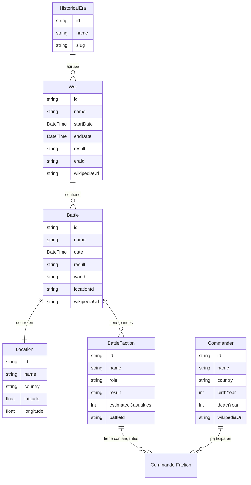

# Modelo de datos

El esquema Prisma está diseñado para ser extensible sin migraciones destructivas. Las features post-MVP se añaden como modelos nuevos que referencian los existentes por foreign key.

---

## Diagrama de entidades

---

## Entidades

### `HistoricalEra`
Agrupa los conflictos por período histórico. Valores predefinidos: Antigüedad, Edad Media, Era Moderna, Contemporánea, Siglo XX, Siglo XXI.

### `War`
Conflicto padre. Puede contener cero o más batallas. Campos clave: `startDate`, `endDate`, `result`, `eraId`, `wikipediaUrl`.

### `Battle`
Enfrentamiento concreto dentro de una guerra. Siempre pertenece a una `War` y tiene una `Location`. Campos clave: `date`, `result`, `warId`, `locationId`, `wikipediaUrl`.

### `BattleFaction`
Cada bando en una batalla. `role` puede ser `attacker` o `defender`. `result` indica si ese bando ganó, perdió o empató. `estimatedCasualties` puede ser `null` si no se conoce.

### `Commander`
Persona que mandó tropas. Se relaciona con facciones a través de `CommanderFaction` (muchos-a-muchos).

### `Location`
Punto geográfico. `latitude` y `longitude` en WGS84 decimal. En la base de datos se almacena como `GEOMETRY(Point, 4326)` via PostGIS.

---

## Modelos futuros (post-MVP)

| Modelo | Propósito |
|---|---|
| `CasualtyReport` | Desglose detallado de bajas por categoría |
| `ResearchNote` | Notas del usuario vinculadas a una batalla o guerra |
| `Collection` | Listas de batallas guardadas por el usuario |
| `AIAnalysis` | Análisis estratégico generado por Claude API |
