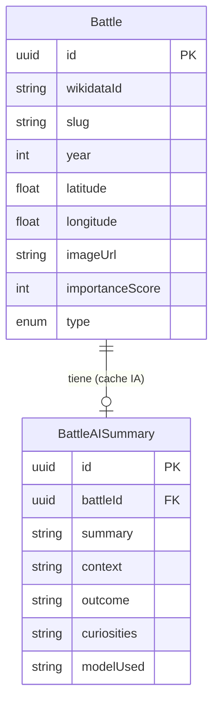

# Modelo de datos

Modelo **intencionadamente simple**: el dominio es una sola entidad principal,
`Battle`, más el caché de narrativa por IA, `BattleAISummary`. Las fechas son
**años (Int)** para alimentar el timeline; las coordenadas, `Float`. No hay
guerras ni comandantes (descartados por falta de datos fiables).

---

## Entidades

### `Battle`
`id`, `wikidataId?` (único), `name`, `slug` (único), `year?`, `startYear?`,
`endYear?`, `date?`/`startDate?`/`endDate?` (ISO "YYYY-MM-DD" cuando Wikidata
tiene precisión de día), `latitude?`, `longitude?`, `imageUrl?`,
`wikipediaUrl?`, `summary?` (extract de Wikipedia), `type`
(`BATTLE`/`SIEGE`/`CAMPAIGN`), `importanceScore` (0-100, nº de sitelinks),
`createdAt`, `updatedAt`.

Los años (`Int`) alimentan el timeline y los filtros; las fechas exactas
(`String`) son para mostrar el día concreto de inicio/fin en la ficha.

Índices: `year`, `(latitude, longitude)`, `importanceScore`.

### `BattleAISummary`
Caché **permanente** de la narrativa por IA. Una fila por batalla
(`battleId` único). Campos: `summary`, `context`, `outcome`, `curiosities`,
`modelUsed`, `promptHash`. Ver [IA (LLM)](../backend/ia.md).

---

## Diagrama

Los datos se cargan con la [ingesta de Wikidata/Wikipedia](../backend/ingesta.md)
o el seed offline.
