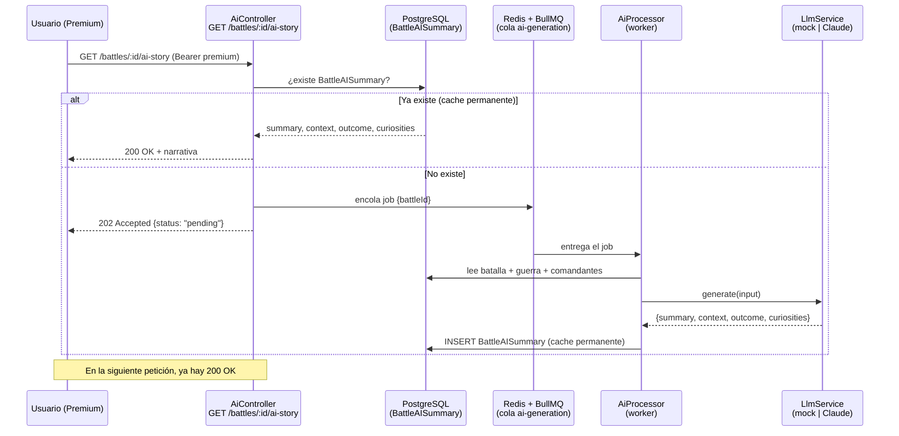

# IA — Narrativas generadas por LLM

AresCodex enriquece las batallas con narrativas generadas por un modelo de
lenguaje (LLM): un **Story Mode**, el **contexto estratégico**, el **resultado**
y **curiosidades**. Esta es la funcionalidad **Premium** de la aplicación.

La regla de arquitectura más importante es:

!!! danger "Zero Real-Time Generation"
    **Nunca** se llama al LLM dentro de una petición HTTP del usuario. Toda la
    generación se precomputa en **background** con workers (BullMQ) y se
    almacena de forma **permanente** en la base de datos. Una petición de
    usuario, como mucho, **encola** un trabajo y responde al instante.

---

## Visión general del flujo



---

## Piezas (módulo `src/ai/`)

| Archivo | Rol |
|---------|-----|
| `ai.controller.ts` | Endpoint Premium `GET /battles/:id/ai-story`. Devuelve **200** con la narrativa si existe, o **202** `pending` si la encola. Protegido por `PremiumGuard` y con rate limit estricto (`@Throttle`). |
| `ai-queue.service.ts` | Fachada sobre la cola BullMQ. `enqueue()` usa `jobId = battleId` → **idempotente** (encolar dos veces = un solo job). |
| `ai.processor.ts` | Worker (`@Processor`). Recoge el contexto de la batalla, llama al `LlmService` y persiste `BattleAISummary`. Si ya existe, lo respeta (no regenera). |
| `llm.service.ts` | Único punto que habla con el LLM. Decide entre `mock` y `anthropic` según `AI_PROVIDER`. |
| `ai.types.ts` | Contratos compartidos (`AIStory`, `BattleAIInput`, `GenerateAIJobData`). |

### Caché permanente

La narrativa vive en la tabla `battle_ai_summaries` (modelo
`BattleAISummary`), con una fila por batalla (`battleId @unique`). Una vez
generada **no se regenera automáticamente** — sólo un batch administrativo la
invalidaría. Así el coste del LLM se paga **una sola vez** por batalla.

Cada fila guarda `modelUsed` (p. ej. `mock` o `claude-sonnet-4-6`) y
`promptHash` (hash del input) para poder auditar con qué se generó.

### Pre-generación por importancia

El `seed` (y cualquier ingesta) encola automáticamente la IA de las batallas
con `importanceScore` mayor que `AI_AUTO_QUEUE_MIN_SCORE` (por defecto 80).
Así las batallas relevantes ya tienen narrativa antes de que nadie la pida.

---

## Cómo enchufar el LLM (Claude)

Por defecto el sistema funciona en modo **`mock`**: genera una plantilla local,
sin coste y sin red, ideal para desarrollar el frontend. Para usar **Claude**
de verdad:

### 1. Consigue una API key de Anthropic

Entra en [console.anthropic.com](https://console.anthropic.com/), crea una
clave (formato `sk-ant-...`) y asegúrate de tener saldo/billing activo.

### 2. Configura las variables de entorno

En el fichero **`.env`** de la raíz del proyecto:

```dotenv
AI_PROVIDER=anthropic
ANTHROPIC_API_KEY=sk-ant-tu-clave-real-aqui
AI_MODEL=claude-sonnet-4-6        # o claude-opus-4-8 para máxima calidad
AI_AUTO_QUEUE_MIN_SCORE=80
```

| Variable | Significado |
|----------|-------------|
| `AI_PROVIDER` | `mock` (defecto) o `anthropic`. |
| `ANTHROPIC_API_KEY` | Tu clave. Si está vacía con `AI_PROVIDER=anthropic`, el servicio avisa y cae a `mock`. |
| `AI_MODEL` | ID del modelo de Claude. |
| `AI_AUTO_QUEUE_MIN_SCORE` | Umbral de `importanceScore` para pre-generar. |

### 3. Reinicia el backend

```bash
docker compose -f docker-compose.yml -f docker-compose.dev.yml up -d --force-recreate backend
```

En el arranque verás en los logs:

```
LLM listo: anthropic (claude-sonnet-4-6)
```

(o `LLM listo: mock (sin coste, sin red)` si sigue en mock).

### 4. Genera narrativas

- **Automático**: al correr el seed, las batallas con score alto se encolan
  solas. El worker las procesa en segundo plano.
- **A demanda**: entra como Premium en una batalla en el frontend; si no hay
  narrativa, se encola y aparece *"generándose…"*. Recarga en unos segundos.

```bash
# Forzar el seed (también encola la IA de las batallas relevantes)
./backend/scripts/seed.sh
```

!!! tip "Coste contenido"
    El `LlmService` usa **prompt caching** de Anthropic: el system prompt es
    estable entre batallas, así que se reutilizan tokens y baja el coste al
    procesar colas largas. Sumado al caché permanente en BD, cada batalla se
    paga una sola vez.

---

## Tiers: Free vs Premium

| | Free | Premium |
|---|------|---------|
| Mapa, timeline, listados, detalle | ✅ | ✅ |
| `GET /battles`, `/battles/points`, `/battles/:id` | ✅ | ✅ |
| Narrativa IA `GET /battles/:id/ai-story` | ❌ 403 | ✅ |
| Rate limit | Global generoso (120/min) | Endpoint IA: 30/min |

El gating es un **JWT** con la claim `tier`. En desarrollo se obtiene en
`POST /auth/dev-token` con `{ "tier": "premium" }` (deshabilitado en
producción). En el frontend, el botón **"Activar Premium"** de la barra
superior lo hace por ti.

---

## Probar el endpoint a mano

```bash
# 1. Conseguir un token premium (sólo en NODE_ENV=development)
TOKEN=$(curl -s -X POST http://localhost:3000/auth/dev-token \
  -H 'Content-Type: application/json' \
  -d '{"tier":"premium"}' | sed -E 's/.*"token":"([^"]+)".*/\1/')

# 2. Pedir la narrativa de una batalla (por slug o id)
curl -s http://localhost:3000/battles/batalla-de-lepanto/ai-story \
  -H "Authorization: Bearer $TOKEN"
```

- Primera vez sin narrativa → `202 {"status":"pending"}` (queda encolada).
- Tras unos segundos → `200` con `summary`, `context`, `outcome`,
  `curiosities`, `modelUsed`, `generatedAt`.
- Sin token o con tier free → `401` / `403`.
