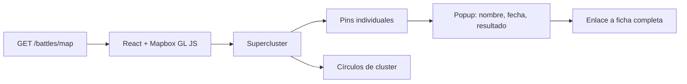

# Map Explorer

**Ruta**: `/map`

La feature más visual de AresCodex. Con datos reales de miles de batallas georreferenciadas, el mapa ya es impresionante de por sí.

---

## Funcionamiento



---

## Características MVP

- **Mapa a pantalla completa** con fondo oscuro (tema Mapbox Dark)
- **Clustering automático**: los pins se agrupan al alejar el zoom y se expanden al acercar
- **Popup al clicar un pin**: nombre, fecha, resultado y botón "Ver ficha completa"
- **Panel de filtros lateral**: era histórica, tipo de batalla, resultado
- **Carga lazy**: los datos del mapa se cargan una sola vez y se almacenan en React Query con TTL largo

---

## Endpoint del mapa

El frontend llama a un endpoint optimizado que devuelve solo los campos necesarios para renderizar pins (sin descripción ni detalle de facciones):

```
GET /battles/map?era=wwii&result=victory
```

```json
[
  { "id": "...", "name": "Batalla de Stalingrado", "lat": 48.7, "lon": 44.5, "result": "victory", "date": "1943-02-02" }
]
```

---

## Lo que viene en v2

- **Heatmap** de densidad de conflictos por región
- **Slider temporal** para ver la evolución de una guerra batalla a batalla
- **Trayectorias animadas** de movimientos de tropas
