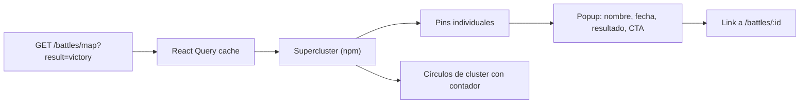

# Map Explorer

**Ruta**: `/map`

El mapa es una representación topográfica generada íntegramente con CSS y SVG — sin dependencias de Mapbox, Leaflet ni tiles externos. Está preparado para conectar con datos reales y una librería de mapas real en v2.

---

## Implementación actual (MVP)

### MapBackdrop

Componente `MapBackdrop.tsx` que construye el fondo con:

- `background-image` multicapa de `radial-gradient` para simular terreno y vegetación
- `repeating-radial-gradient` para curvas de nivel topográficas
- SVG superpuesto con paths de coastlines estilizadas (opacidad 0.5)
- Grid de coordenadas opcional (CSS `linear-gradient` a 60px × 60px)

### Pins y clusters

- `MapPin`: círculo posicionado con `left/top` en porcentaje del contenedor. Color codificado por resultado (gold/crimson/blue/orange). Efecto de brillo con `box-shadow`.
- `MapCluster`: círculo con contador y anillo exterior translúcido.
- Las posiciones son coordenadas de viewport manuales en `pinPositions` (Record en `MapExplorer.tsx`).

### Interacción

```
Click en pin → setSelected(battle) → popup posicionado sobre el pin
Click fuera  → setSelected(null) → popup se cierra
Filtro       → setFilter(result) → solo se renderizan pins del resultado seleccionado
```

---

## Flujo de datos futuro (v2)



### Endpoint objetivo

```
GET /battles/map?era=contemporary&result=victory
```

```json
[
  {
    "id": "stalingrado",
    "name": "Batalla de Stalingrado",
    "lat": 48.708,
    "lon": 44.513,
    "result": "victory",
    "date": "1943-02-02",
    "war": "Segunda Guerra Mundial"
  }
]
```

---

## Roadmap del mapa

| Feature | Versión |
|---|---|
| SVG backdrop estático | MVP ✓ |
| Pins con filtros por resultado | MVP ✓ |
| Popup de batalla | MVP ✓ |
| Tiles reales (Mapbox/MapLibre) | v2 |
| Clustering con Supercluster | v2 |
| Filtro por era con slider | v2 |
| Heatmap de densidad | v3 |
| Animación de movimientos | v3 |
