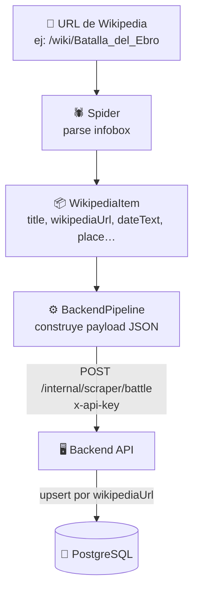

# Scraper — Visión general

El scraper es un servicio Python independiente basado en **Scrapy 2.15** que extrae datos de batallas históricas de Wikipedia y los envía a la API del backend.

---

## Estructura del proyecto

```
scraper/
├── Dockerfile
├── requirements.txt
└── ares/
    ├── scrapy.cfg
    └── ares/
        ├── settings.py        # Configuración de Scrapy y pipeline
        ├── items.py           # Definición del WikipediaItem
        ├── pipelines.py       # BackendPipeline: envía items al backend
        ├── middlewares.py     # Middlewares custom
        └── spiders/
            └── wikipedia.py   # Spider: parsea infoboxes de Wikipedia
```

---

## Flujo de extracción



1. **Spider**: extrae los campos de la infobox de cada artículo de Wikipedia
2. **Item**: encapsula los datos extraídos en un `WikipediaItem`
3. **Pipeline**: recibe el item, construye el payload y lo envía al backend via HTTP
4. **Backend**: valida, desduplicita por `wikipediaUrl` y persiste en PostgreSQL

!!! warning "El scraper nunca escribe directamente en PostgreSQL"
    Toda inserción pasa por la API del backend para mantener las validaciones centralizadas.

---

## Ejecutar el scraper

### Con backend activo (modo normal)

```bash
# Desde la raíz del proyecto
docker compose -f docker-compose.yml -f docker-compose.dev.yml --profile manual run --rm scraper \
  sh -c "cd ares && scrapy crawl wikipedia"
```

### Dry-run local (sin enviar al backend)

```bash
cd scraper/ares
pip install -r ../requirements.txt

# Exporta a JSON sin tocar la BD (requiere comentar BackendPipeline en settings.py)
scrapy crawl wikipedia -o output.json
```

### Variables de entorno necesarias

```bash
BACKEND_URL=http://backend:3000   # nombre del servicio dentro de Docker
SCRAPER_API_KEY=tu-clave-secreta
```

---

## Secciones

- [Spider de Wikipedia](spider.md) — Lógica de parsing de infoboxes
- [Items y campos](items.md) — Estructura del `WikipediaItem` y campos
- [Pipeline](pipeline.md) — `BackendPipeline`: cómo los items llegan al backend
- [Configuración](configuracion.md) — Throttling, concurrencia y variables de entorno
