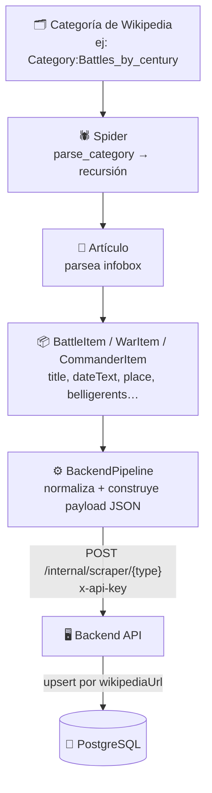

# Scraper — Visión general

El scraper es un servicio Python independiente basado en **Scrapy 2.15** que extrae datos de batallas, guerras y comandantes históricos de Wikipedia y los envía a la API del backend.

---

## Estructura del proyecto

```
scraper/
├── Dockerfile
├── requirements.txt
└── ares/
    ├── scrapy.cfg
    └── ares/
        ├── settings.py        # Configuración de Scrapy, throttling y pipeline
        ├── items.py           # BattleItem, WarItem, CommanderItem
        ├── pipelines.py       # BackendPipeline: normaliza y envía items al backend
        ├── normalizers.py     # Normalización de fechas, coordenadas y bajas
        ├── middlewares.py     # Middlewares custom
        └── spiders/
            └── wikipedia.py   # Spider: navega categorías y parsea infoboxes
```

---

## Flujo de extracción



1. **Spider**: navega categorías de Wikipedia recursivamente (hasta 2 niveles de subcategorías)
2. **Parseo**: extrae campos de la infobox de cada artículo en español o inglés
3. **Item**: encapsula los datos crudos en `BattleItem`, `WarItem` o `CommanderItem`
4. **Pipeline**: normaliza fechas, coordenadas y bajas, luego envía al backend via HTTP
5. **Backend**: valida, desduplicita por `wikipediaUrl` y persiste en PostgreSQL

!!! warning "El scraper nunca escribe directamente en PostgreSQL"
    Toda inserción pasa por la API del backend para mantener las validaciones centralizadas.

---

## Ejecutar el scraper

### Con backend activo (modo normal)

```bash
# Desde la raíz del proyecto
docker compose -f docker-compose.yml -f docker-compose.dev.yml --profile manual run --rm scraper \
  sh -c "cd ares && scrapy crawl wikipedia"
```

### Dry-run local (sin enviar al backend)

```bash
cd scraper/ares
pip install -r ../requirements.txt

# Exporta a JSON sin tocar la BD (requiere comentar BackendPipeline en settings.py)
scrapy crawl wikipedia -o output.json
```

### Limitar el crawl durante desarrollo

```bash
# Solo 50 páginas (útil para probar sin esperar horas)
SCRAPY_HTTPCACHE=1 scrapy crawl wikipedia -s CLOSESPIDER_PAGECOUNT=50
```

### Variables de entorno necesarias

```bash
BACKEND_URL=http://backend:3000   # nombre del servicio dentro de Docker
SCRAPER_API_KEY=tu-clave-secreta
```

---

## Secciones

- [Spider de Wikipedia](spider.md) — Rastreo de categorías y parsing de infoboxes
- [Items y campos](items.md) — `BattleItem`, `WarItem`, `CommanderItem`
- [Pipeline](pipeline.md) — `BackendPipeline`: normalización y envío al backend
- [Normalización](normalizacion.md) — Fechas ISO, coordenadas WGS84, rango de bajas
- [Configuración](configuracion.md) — Throttling, AutoThrottle, caché HTTP y variables de entorno
