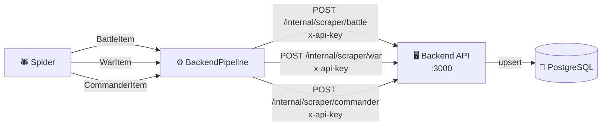

# Pipeline del scraper

**Archivo**: `scraper/ares/ares/pipelines.py`

El pipeline conecta el scraper con el backend. Recibe cada item extraído por el spider, construye el payload JSON y lo envía al endpoint del backend que corresponde según el tipo de entidad.

---

## Arquitectura



---

## Routing por tipo

El pipeline lee el campo `type` de cada item para decidir a qué endpoint enviarlo:

| `type` | Endpoint | Clave de upsert |
|---|---|---|
| `"battle"` | `POST /internal/scraper/battle` | `wikipediaUrl` |
| `"war"` | `POST /internal/scraper/war` | `wikipediaUrl` |
| `"commander"` | `POST /internal/scraper/commander` | `wikipediaUrl` |

Items con un `type` desconocido se descartan con un warning en el log.

---

## `BackendPipeline`

### Ciclo de vida

| Método | Cuándo se ejecuta | Qué hace |
|---|---|---|
| `open_spider` | Al arrancar el spider | Lee `BACKEND_URL` y `SCRAPER_API_KEY` del entorno |
| `process_item` | Por cada item extraído | Enruta por tipo, construye payload y llama a `_send` |

### Código

```python
class BackendPipeline:

    def open_spider(self, spider):
        self.backend_url = os.environ.get('BACKEND_URL', 'http://localhost:3000').rstrip('/')
        self.api_key = os.environ.get('SCRAPER_API_KEY', '')

    def process_item(self, item, spider):
        adapter = ItemAdapter(item)
        item_type = adapter.get('type')          # "battle" | "war" | "commander"

        payload = self._build_payload(item_type, adapter)
        self._send(item_type, payload)
        return item
```

---

## Construcción del payload

Cada tipo de item tiene su propio método de construcción. Los campos `None` se omiten del payload para no sobreescribir datos existentes en el backend con valores vacíos.

### `BattleItem` → `ScraperBattleDto`

| Campo item | Campo payload | Notas |
|---|---|---|
| `type` | `type` | `"battle"` |
| `title` | `title` | Requerido |
| `wikipediaUrl` | `wikipediaUrl` | Clave de upsert |
| `imageUrl` | `imageUrl` | Solo si no es `None` |
| `dateText` | `dateText` | Fecha raw. El campo `date` ISO queda para la normalización futura |
| `place` | `place` | — |
| `result` | `result` | — |
| `belligerents` | `belligerents` | `{ side1, side2 }` |
| `commanders` | `commanders` | `{ side1, side2 }` |
| `strength` | `strength` | `{ side1, side2 }` |
| `casualties` | `casualties` | `{ side1, side2 }` |

### `WarItem` → `ScraperWarDto`

| Campo item | Campo payload | Notas |
|---|---|---|
| `type` | `type` | `"war"` |
| `title` | `title` | Requerido |
| `wikipediaUrl` | `wikipediaUrl` | Clave de upsert |
| `imageUrl` | `imageUrl` | Solo si no es `None` |
| `dateText` | `dateText` | Rango de fechas raw, ej: `"1936–1939"` |
| `description` | `description` | Primer párrafo del artículo |
| `place` | `place` | — |
| `result` | `result` | — |
| `belligerents` | `belligerents` | `{ side1, side2 }` |
| `commanders` | `commanders` | `{ side1, side2 }` |
| `casualties` | `casualties` | `{ side1, side2 }` |

### `CommanderItem` → `ScraperCommanderDto`

| Campo item | Campo payload | Notas |
|---|---|---|
| `type` | `type` | `"commander"` |
| `name` | `name` | Requerido (clave de búsqueda) |
| `wikipediaUrl` | `wikipediaUrl` | Clave de upsert |
| `imageUrl` | `imageUrl` | Solo si no es `None` |
| `country` | `country` | Lealtad o país |
| `birthYear` | `birthYear` | Entero, ej: `1892` |
| `deathYear` | `deathYear` | Entero, ej: `1975` |
| `description` | `description` | Primer párrafo del artículo |

---

## Envío HTTP (`_send`)

Usa únicamente `urllib` de la librería estándar de Python.

```python
req = urllib.request.Request(
    url=f"{backend_url}/internal/scraper/{item_type}",
    data=json.dumps(payload).encode('utf-8'),
    headers={
        'Content-Type': 'application/json',
        'x-api-key': api_key,
    },
    method='POST',
)
```

### Gestión de errores

| Caso | Comportamiento |
|---|---|
| HTTP 4xx / 5xx | Log de error con código y body. El scraper continúa. |
| Sin conexión al backend | Log de error con la causa. El scraper continúa. |
| `type` desconocido | Warning + descarte antes de hacer la petición. |
| Sin clave de upsert | Warning + descarte antes de hacer la petición. |

!!! warning "El pipeline no reintenta"
    Si el backend devuelve un error, el item se pierde en esa ejecución.
    Para producción se recomienda implementar reintentos con backoff.

---

## Activación en `settings.py`

```python
ITEM_PIPELINES = {
    "ares.pipelines.BackendPipeline": 300,
}
```

---

## Modo dry-run (sin enviar al backend)

```bash
# Comenta BackendPipeline en settings.py y ejecuta:
cd scraper/ares
scrapy crawl wikipedia -o output.json
```

---

## Logs de ejecución

```
INFO  Upserted battle 'Batalla del Ebro' → batalla-del-ebro
INFO  Upserted war 'Guerra Civil Española' → guerra-civil-espanola
INFO  Upserted commander 'Francisco Franco' → cm3x...
ERROR Backend HTTP 401 para battle https://...: Unauthorized
```
