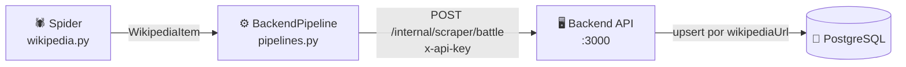

# Pipeline del scraper

**Archivo**: `scraper/ares/ares/pipelines.py`

El pipeline es la pieza que conecta el scraper con el backend. Cada vez que el spider extrae un `WikipediaItem`, el pipeline lo recibe, construye el payload JSON y lo envía al endpoint interno del backend.

---

## Arquitectura



---

## `BackendPipeline`

### Ciclo de vida

| Método | Cuándo se ejecuta | Qué hace |
|---|---|---|
| `open_spider` | Al arrancar el spider | Lee `BACKEND_URL` y `SCRAPER_API_KEY` del entorno |
| `process_item` | Por cada item extraído | Construye el payload y lo envía al backend |

### Código

```python
class BackendPipeline:

    def open_spider(self, spider):
        self.backend_url = os.environ.get("BACKEND_URL", "http://localhost:3000").rstrip("/")
        self.api_key = os.environ.get("SCRAPER_API_KEY", "")

    def process_item(self, item, spider):
        adapter = ItemAdapter(item)
        payload = self._build_payload(adapter)

        if not payload.get("wikipediaUrl"):
            logger.warning("Item sin wikipediaUrl, se descarta: %s", payload.get("title"))
            return item

        self._send(payload)
        return item
```

---

## Construcción del payload (`_build_payload`)

El pipeline mapea los campos del `WikipediaItem` al `ScraperBattleDto` que espera el backend:

| Campo en item | Campo en payload | Notas |
|---|---|---|
| `type` | `type` | Siempre `"battle"` en MVP |
| `title` | `title` | Requerido |
| `wikipediaUrl` | `wikipediaUrl` | Clave de upsert — requerido |
| `imageUrl` | `imageUrl` | Omitido si `None` |
| `dateText` | `dateText` | Fecha raw. El campo `date` (ISO) queda pendiente hasta la normalización |
| `place` | `place` | Omitido si `None` |
| `result` | `result` | Omitido si `None` |
| `belligerents` | `belligerents` | `{ side1, side2 }` |
| `commanders` | `commanders` | `{ side1, side2 }` |
| `strength` | `strength` | `{ side1, side2 }` |
| `casualties` | `casualties` | `{ side1, side2 }` |

!!! info "Campo `date` (ISO 8601)"
    El backend acepta tanto `dateText` (texto raw) como `date` (fecha normalizada). Por ahora el pipeline solo envía `dateText`. El campo `date` se poblará cuando se implemente la normalización de fechas.

---

## Envío HTTP (`_send`)

Usa únicamente `urllib` de la librería estándar de Python — sin dependencias adicionales.

```python
req = urllib.request.Request(
    url="http://backend:3000/internal/scraper/battle",
    data=json.dumps(payload).encode("utf-8"),
    headers={
        "Content-Type": "application/json",
        "x-api-key": "<SCRAPER_API_KEY>",
    },
    method="POST",
)
```

### Gestión de errores

| Caso | Comportamiento |
|---|---|
| HTTP 4xx / 5xx | Log de error con el código y el body de respuesta. El scraper continúa con el siguiente item. |
| Sin conexión al backend | Log de error con la causa. El scraper continúa. |
| Item sin `wikipediaUrl` | Se descarta con un warning antes de hacer la petición. |

!!! warning "El pipeline no reintenta"
    Si el backend devuelve un error, el item se pierde en esa ejecución. Para producción se recomienda implementar reintentos con backoff o una cola de mensajes.

---

## Activación en `settings.py`

```python
ITEM_PIPELINES = {
    "ares.pipelines.BackendPipeline": 300,
}
```

El número `300` es la prioridad (0–1000). Un valor menor ejecuta el pipeline antes.

---

## Modo dry-run (sin enviar al backend)

Para depurar el spider sin modificar la BD, comenta el pipeline en `settings.py` y exporta a JSON:

```bash
# Desactiva BackendPipeline temporalmente en settings.py, luego:
cd scraper/ares
scrapy crawl wikipedia -o output.json
```

---

## Logs de ejecución

Con el pipeline activo verás en consola una línea por batalla procesada:

```
INFO  Upserted 'Batalla del Ebro' → id=cm3x... slug=batalla-del-ebro
ERROR Backend devolvió HTTP 401 para 'https://...': Unauthorized
```
